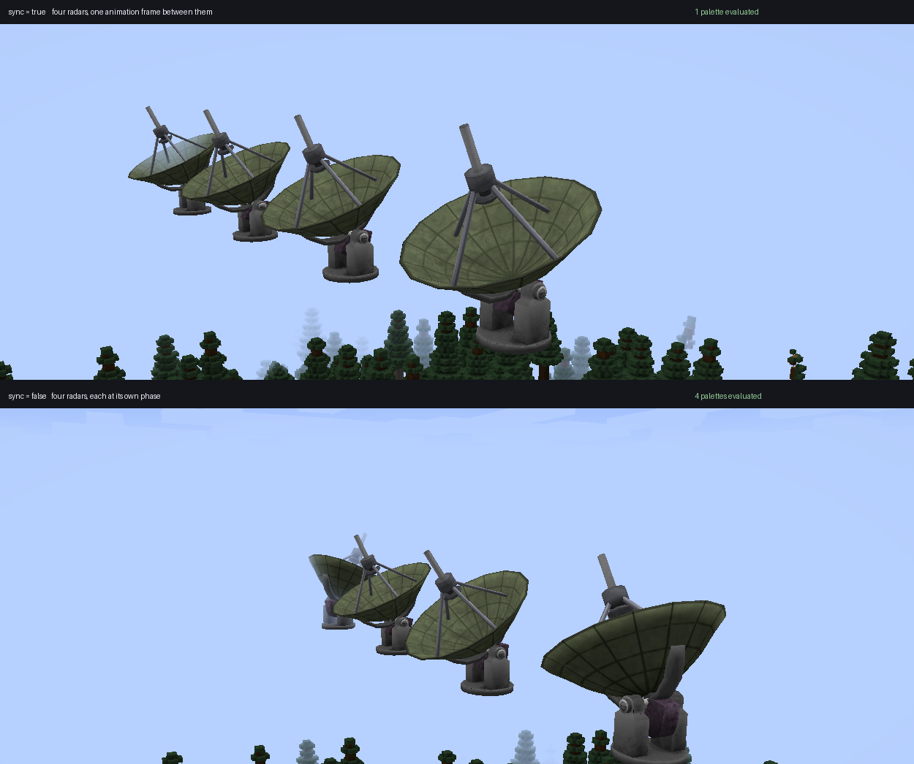

# GemRender

A GPU-driven model and animation renderer for Minecraft 1.21.1 (NeoForge).

GemRender ties together three things that already exist separately and have never been made to work as
one: a **glTF 2.0 asset pipeline**, **Flywheel's retained instancing and GPU culling**, and **skinning
evaluated on the GPU**. Animated models stay instanced – one draw call per model per batch, however
many copies are on screen.



*Four copies of a six-node, three-material, two-clip radar. Each is **one** Flywheel instance despite
having three separately-moving parts: the parts move through a bone palette, not through separate
draws. No two are on the same animation frame.*

## What it does

- **Imports glTF 2.0** – node animation, skinning and morph targets, all three of glTF's animation
  mechanisms, plus metallic-roughness materials with normal, emissive, metallic-roughness and
  occlusion maps. A model's textures are stitched at import, so a multi-part machine is a single draw.
- **Imports Bedrock `.geo.json`** through the same pipeline, for assets authored as Minecraft models.
- **Rigs a model that has none** – declare a skeleton in code with `RigBuilder` and bind Wavefront OBJ
  geometry to it.
- **Skins in the vertex shader Flywheel already runs**, not in a pre-pass. Cost is O(visible vertices)
  rather than O(instances × vertices), the mesh stays shared, and Flywheel's GPU frustum and occlusion
  culling keep applying.
- **Shares work between copies that agree.** A copy's animation phase is a pure function of the world
  clock and its own position, so it needs no stored state and survives a chunk reload identically;
  copies genuinely at the same instant share one evaluated bone palette, and copies that are not, do
  not.
- **Animates without a clip.** An animation is a list of drivers, and a glTF channel is only one kind:
  a shaft can be given a rate instead of a keyframe track. Drivers compose rather than replace.

```java
NodeTable nodes = model.layout().nodeTable();
GltfAnimation turning = model.animation("running_loop")
        .with(NodeSpin.aboutY(nodes, nodes.slotOf(mastNode), rpm / 60.0f));
```

Transparent materials go through order-independent transparency, distant copies are animated on a
coarser time grid at constant on-screen error, and textures may be KTX2.

## Using it

**[docs/INTEGRATION.md](docs/INTEGRATION.md)** is the API guide: registering an asset, rendering it on
a block entity, rigging a model in code, and why items need a separate path.

```gradle
dependencies {
    compileOnly files('libs/gemrender-1.21.1-0.1.0.jar')
}
```

GemRender is a **required client-side dependency** of a mod that draws through it – declare it in
`neoforge.mods.toml`.

## Building

```bash
./gradlew build       # compile, unit tests, shader validation
./gradlew test        # unit tests: pure JVM, no GPU needed
./gradlew glTest      # GPU tests against a real OpenGL 4.6 driver
./gradlew runClient   # dev client
```

## Requirements

- Java 21 (auto-provisioned by the foojay toolchain resolver)
- Minecraft 1.21.1 / NeoForge 21.1.248
- **OpenGL 4.2**, and only for BC7 atlas compression – nothing in the shaders needs more than
  Flywheel's own 3.3 floor
- Flywheel 1.0.6, **required** and jar-in-jar'd, so there is nothing to install alongside. Create
  nests it under the same coordinate, so a pack carrying both resolves them to one copy, and a
  Flywheel in `mods/` displaces both
- Iris is `compileOnly` and optional. `com.wf.gemrender.iris` names Iris types to register a LabPBR
  loader, and that package is entered only after a `ModList` check
- `org.lwjgl:lwjgl-ktx` for `.ktx2` model textures and for encoding stitched sheets – jar-in-jar'd,
  pinned to the LWJGL version Minecraft ships

`glTest` needs a GL 4.6 driver and skips cleanly without one.

## Source set guide

| |                                                          |
|---|----------------------------------------------------------|
| `src/main` | the mod                                                  |
| `src/test` | unit tests, and GPU tests tagged `gl`                    |
| `src/harness`, `src/bench` | the development spike and the cross-framework benchmark  |
| `docs/INTEGRATION.md` | the API guide                                            |

Design notes, research, the test plan, benchmark fixtures and third-party assets are not part of this
repository. The build looks for them in a sibling checkout at `../gemrender-internal`, overridable
with `-PinternalDir=<path>`, and every task that reads from it skips cleanly when it is absent.

## Licence

GPL-3. Vendored third-party source retains its own licences.
